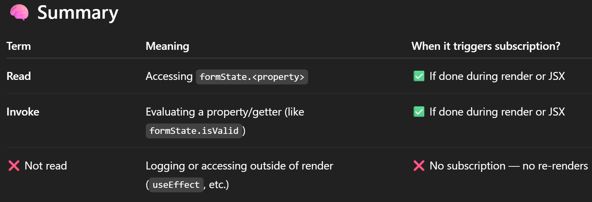

# Index

- [Index](#index)
  - [`formState`](#formstate)
  - [What is subscription and why is it important with formState? :](#what-is-subscription-and-why-is-it-important-with-formstate-)
    - [How to create subscription? :](#how-to-create-subscription-)
      - [Read](#read)
      - [Invoke](#invoke)
    - [What doesn’t count as Subscription? : ❌](#what-doesnt-count-as-subscription--)
    - [✅ Examples that **do create a subscription**](#-examples-that-do-create-a-subscription)
      - [Used directly in JSX:](#used-directly-in-jsx)
      - [Used in a conditional or logic that runs during render:](#used-in-a-conditional-or-logic-that-runs-during-render)
      - [Used inside a derived variable that affects render:](#used-inside-a-derived-variable-that-affects-render)
    - [What if we want to subscribe in places like `useEffect`?](#what-if-we-want-to-subscribe-in-places-like-useeffect)
    - [Subscription with logical operators :](#subscription-with-logical-operators-)
  - [isValidating, isSubmitting :](#isvalidating-issubmitting-)
  - [`getFieldState`](#getfieldstate)
  - [Use of the second argument(formState) in `getFieldState`](#use-of-the-second-argumentformstate-in-getfieldstate)
  - [`useFormContext`](#useformcontext)
    - [Purpose](#purpose)
  - [`useFormState`](#useformstate)
    - [Nested component using useFormState](#nested-component-using-useformstate)
    - [`exact`](#exact)
    - [`control` prop, control object provided by `useForm`](#control-prop-control-object-provided-byuseform)
  - [`watch`](#watch)
    - [What is `watch` and when to use ?](#what-is-watch-and-when-to-use-)
    - [`watch` vs `formState` :](#watch-vs-formstate-)
    - [`watch` re-renders at root component(component using `useForm`) :](#watch-re-renders-at-root-componentcomponent-using-useform-)

## `formState`

https://www.react-hook-form.com/api/useform/formstate/
Contains the state of the whole form, can be used to track **errors**, **submit** status etc.

## What is subscription and why is it important with formState? :

> `formState` is wrapped with a [Proxy](https://developer.mozilla.org/en-US/docs/Web/JavaScript/Reference/Global_Objects/Proxy) to improve render performance and skip extra logic if specific state is not **subscribed** to. Therefore make sure you **invoke or read** it before a `render` in order to enable the state update.

This is written as a rule for using `formState`.
It states if you want to get the state changes available in the `formState` you must be **subscribed to the state change**.

**Subscription means whether the component will get updates(i.e. re-render) if that property in the `formState` changes**

Like if you want to re-render based on the changes in some state in `formState` then the component must be **subscribed** to that state otherwise it is not guaranteed that the component will receive the state change update that is re-rendering of the component.

```ts
const TestSubscription = () => {
	const { register, formState } = useForm(); // Not a subscription to isDirty state

	// Reading the isDirty property from formState but it doesn't count as subscription
	// So it is not guaranteed by RHF that the changes to isDirty will re-render the component
	// "Not guaranteed" which basically means random behavior sometimes it might sometimes it might not
	console.log("isDirty", formState.isDirty); // ❌

  return (
    <>
      <h3>No Destructuring</h3>
      <RenderCount />
      <form>
        <input {...register("test")} type="text" />
      </form>
    </>
  );
};
```

### How to create subscription? :

> Therefore make sure you **invoke or read** it before a `render` in order to enable the state update.

As written in the documentation we must **invoke or read** it before `render`.

#### Read

```ts
const { formState } = useForm();
return <p>{formState.isDirty ? "Yes" : "No"}</p>; // ✅ You're reading it during render i.e. in JSX
```

OR

```ts
const { formState: { isDirty } } = useForm(); // ✅ You're destructuring (reading) it immediately
return <p>{isDirty ? "Yes" : "No"}</p>;
```

#### Invoke

This mostly refers to cases where the `formState` properties are **functions or getters**, and accessing them causes some evaluation.

```ts
const { formState } = useForm();
const dirty = formState.isDirty; // ✅ This counts as invoking/reading
```

### What doesn’t count as Subscription? : ❌

Accessing `formState` after the render phase — such as:

- In `useEffect`
- In `console.log`
- In event handlers
- Destructuring but not using the state during render, i.e. the field state does not affect the render in any way.

```ts
const { formState } = useForm();

useEffect(() => {
  console.log(formState.isDirty); // ❌ Too late — render already happened
}, []);

// 2nd example, Destructured but unused
const { error } = getFieldState("email"); // ❌ no subscription, no guarantee to for error state updates
return <div>No use of error here</div>;

```

> **The value returned by `formState` like `errors` must influence the rendered output — even indirectly — for React Hook Form to track it reactively.**

### ✅ Examples that **do create a subscription**

These will subscribe because the value is read during the render phase:

#### Used directly in JSX:

```ts
const { error } = getFieldState("email");
return <div>{error?.message}</div>;
```

#### Used in a conditional or logic that runs during render:

```ts
const { error } = getFieldState("email");
const hasError = !!error;
return <div>{hasError && "There’s an error"}</div>;
```

#### Used inside a derived variable that affects render:

```ts
const { error } = getFieldState("email");
const color = error ? "red" : "black";
return <p style={{ color }}>Email</p>;
```



### What if we want to subscribe in places like `useEffect`?

`formState` is updated in batch. If you want to subscribe to like `error` in `formState` via `useEffect`, make sure that you place the entire `formState` in the optional array.

```ts
useEffect(() => {
  if (formState.errors.firstName) {
    // do the your logic here
  }
}, [formState]); // ✅
// ❌ formState.errors will not trigger the useEffect
```

### Subscription with logical operators :

Pay attention to the logical operator when subscription to `formState`.

```ts
// ❌ formState.isValid is accessed conditionally,
// so the Proxy does not subscribe to changes of that state
return <button disabled={!formState.isDirty || !formState.isValid} />;

// ✅ read all formState values to subscribe to changes
const { isDirty, isValid } = formState;
return <button disabled={!isDirty || !isValid} />;
```

## isValidating, isSubmitting :

These properties are helpful for async operations.

`async` validation → `isValidating` will be true when the validation is in pending state and when resolved it will be false.
`async` form submission → `isSubmitting`

```ts
import { useForm } from "react-hook-form";
import { useState } from "react";

// Simulated async username check
const checkUsernameAvailability = async (username: string): Promise<boolean> => {
  await new Promise((res) => setTimeout(res, 1000)); // 1 second delay
  return username !== "taken"; // Simulate "taken" is unavailable
};

type FormDataType = {
  username: string;
};

const AsyncValidationAndSubmission = () => {
  const {
    register,
    handleSubmit,
    formState: { isSubmitting, isValidating, errors },
  } = useForm<FormDataType>({
    mode: "onChange",
  });

  const [submittedData, setSubmittedData] = useState<FormDataType>({
    username: "",
  });

  const onSubmit = async (data: FormDataType) => {
    // Simulate network delay
    await new Promise((res) => setTimeout(res, 1000));
    setSubmittedData(data);
  };

  return (
    <form onSubmit={handleSubmit(onSubmit)}>
      <input
        type="text"
        placeholder="Username"
        {...register("username", {
          required: "Username is required",
          validate: async (value) =>
            (await checkUsernameAvailability(value)) || "Username already taken",
        })}
      />
      {errors.username && <p style={{ color: "red" }}>{errors.username.message}</p>}

      {/* Show async validation status */}
      {isValidating && <p style={{ color: "blue" }}>Checking username availability...</p>}

      {/* Show submission status */}
      {isSubmitting && <p style={{ color: "orange" }}>Submitting form...</p>}

      <button type="submit" disabled={isSubmitting || isValidating}>
        {isSubmitting ? "Submitting..." : "Submit"}
      </button>

      {/* Display submitted data */}
      {submittedData.username && (
        <pre style={{ background: "#777", padding: "10px", marginTop: "10px" }}>
          Submitted: {JSON.stringify(submittedData, null, 2)}
        </pre>
      )}
    </form>
  );
};

export default AsyncValidationAndSubmission;
```

## `getFieldState`

Subscription logic for `getFieldState` is similar to `formState`.
The value retrieved from `getFieldState` must influence the render output in a direct or indirect way to create subscription and guarantee updates.

## Use of the second argument(formState) in `getFieldState`

```ts
import { useForm } from "react-hook-form";
import GetFieldStateChild from "./GetFieldStateChild";

export type AddressFormType = {
  streetAddress: string;
  landmark: string;
  city: string;
  state: string;
};

export type AddressParentFormType = {
  address: AddressFormType;
};

const GetFieldStateParent = () => {
  const { register, control, getFieldState, formState } = useForm<AddressParentFormType>({
    mode: "onChange",
    defaultValues: {
      address: {
        streetAddress: "",
        landmark: "",
        city: "",
        state: "",
      },
    },
  });
  return (
    <form>
      <GetFieldStateChild register={register} control={control} />

      {/* ❌ Using getFieldState but no updates as there is no subscription(i.e. destructuring errors from formState or using formState.error in the JSX directly) set at parent level and child does isolate re-rendering */}
      {/* So parent won't be re-rendered and this won't be visible */}
      {getFieldState("address").invalid && <div>Address is invalid</div>}
    </form>
  );
};

export default GetFieldStateParent;

```

```ts
import { useFormState } from "react-hook-form";
import RenderCount from "../../RenderCount/RenderCount";
import TextField from "../WithReusableControls/controls/TextField";
import type { AddressFormType } from "./GetFieldStateParent";

const GetFieldStateChild = ({ register, control, ...restProps }) => {
  const { errors } = useFormState<{ address: AddressFormType }>({
    name: ["address"],
    exact: false, // subscribe to all the nested properties of address object
    control: control, // Since this component is not inside a Provider
  });

  return (
    <>
      <RenderCount />
      <div className="text-start fw-bold mt-4 mb-2">Address</div>
      <div className="row mb-3">
        <div className="col">
          <TextField
            {...register("address.streetAddress", {
              required: "Street Address is needed.",
            })}
            placeholder="Street address"
            error={errors.address?.streetAddress}
          />
        </div>
        <div className="col">
          <TextField
            {...register("address.city", {
              required: "City is needed.",
            })}
            placeholder="City"
            error={errors.address?.city}
          />
        </div>
      </div>
      <div className="row mb-3">
        <div className="col">
          <TextField
            {...register("address.landmark")}
            placeholder="Landmark"
            error={errors.address?.landmark}
          />
        </div>
        <div className="col">
          <TextField
            {...register("address.state")}
            placeholder="State"
            error={errors.address?.state}
          />
        </div>
      </div>
    </>
  );
};

export default GetFieldStateChild;

```

**Fix**
There are 2 possible solutions :

- Pass the formState as the second argument to getFieldState

```ts
{/* ✅ Creates subscription */}
{getFieldState("address", formState).invalid && <div>Address is invalid</div>}
```

- Destructure the `errors` from fromState

```ts
{
  /* ✅ Destructure errors */
}
const {
  register,
  control,
  getFieldState,
  formState: { errors },
} = useForm<AddressParentFormType>({
  mode: "onChange",
  defaultValues: {
    address: {
      streetAddress: "",
      landmark: "",
      city: "",
      state: "",
    },
  },
});
```

## `useFormContext`

### Purpose

This solves the same purpose for `react-hook-form` as `Context API` solves for state management in React which is **act as a transporter or portal**.
`useFormContext` uses Context API underneath to transport the state and methods related to the state management of the form to any component nested in the `FormProvider`

So `useFormContext` makes it easy to handle nested form components but it is not the only way to do it, it just makes it easy. You
can still pass the methods from the `useForm` hook as props to the nested components if you don’t want to use `useFormContext` for any reason.

## `useFormState`

### Nested component using useFormState

Nested component using useFormState will have the whole formState but only subscribe to the input name given in **name**

### `exact`

This can be useful for cases like nested fields.
If `exact` is false then it does **prefix and case-sensitive matching** i.e. all the inputs matching that prefix will be subscribed.

```ts
type formInputs = {
  customerName: string;
  customerAge: string;
  customerNumber: string;
};

const { errors } = useFormState({
  name: "customer",
  exact: false, // Then it will subscribe to multiple inputs like "customerName", "customerAge",     "customerNumber" etc..
});
```

For nested fields →

```ts
type formInputs = {
  user: {
    name: string;
    age: number;
    mobileNumber: string;
  };
};

const { errors } = useFormState({
  name: "user",
  exact: false, // Then it will subscribe to all nested properties of the user
});
```

### `control` prop, control object provided by `useForm`

> It's optional if you are using FormContext.

This does not mean that it’s optional if you are using `useFormContext` hook in that component but more accurately it means **it’s optional if that component is wrapped in the `FormProvider`**

`useFormContext` internally just uses `Context API` to transport the methods and objects returned from `useForm` hook to all the nested components of the `FormProvider`.
And since `useForm` returns the `control` object when it is called, so all the components nested inside the `FormProvider` automatically have access to the `control` object hence we don’t need to explicitly pass the `control` object to `useFormState`

```ts

const methods = useForm();
return (
	<>
	  <RenderCount text="Parent Render Count" />
	  <FormProvider {...methods}>
		<form onSubmit={handleSubmit(handleFromSubmit, handleFormErrors)} noValidate>
		  <FoodDeliveryMaster />
		  <CheckoutForm />
		  <DeliveryAddressFrom />
		  <SubmitButton buttonText="Submit" />
		</form>
	  </FormProvider>
	</>
);

// SubmitButton.tsx
import { useFormContext, useFormState } from "react-hook-form";

const SubmitButton = ({ buttonText }: { buttonText: string }) => {
  const { isSubmitting } = useFormState(); // ✅ will work because it's inside FormProvider

  return (
    <button type="submit" disabled={isSubmitting}>
      {isSubmitting ? "Submitting..." : buttonText}
    </button>
  );
};

export default SubmitButton;
```

**But we will need to explictly pass the `control` object if the `SubmitButton` is outside `FormProvider`**

```ts
const methods = useForm();
const { control } = methods;
return (
	<>
	  <RenderCount text="Parent Render Count" />

		<form onSubmit={handleSubmit(handleFromSubmit, handleFormErrors)} noValidate>
			<FormProvider {...methods}>
			  <FoodDeliveryMaster />
			  <CheckoutForm />
			  <DeliveryAddressFrom />
			</FormProvider>
			<SubmitButton buttonText="Submit" control={control}/>
		</form>
	</>
);

// SubmitButton.tsx
import { useFormContext, useFormState } from "react-hook-form";

const SubmitButton = ({ buttonText, control }: { buttonText: string, control: Control<any,any> }) => {
  const { isSubmitting } = useFormState({ control }); // ✅
  // but const { isSubmitting } = useFormState(); ❌

  return (
    <button type="submit" disabled={isSubmitting}>
      {isSubmitting ? "Submitting..." : buttonText}
    </button>
  );
};

export default SubmitButton;
```

**`useForm` and `useFormState` in the same component**

```ts
import { useForm, useFormState } from "react-hook-form";

export default function MyForm() {
  const { register, control } = useForm();

  const { isDirty } = useFormState({ control }); // ✅ must pass control here
  // but { isDirty } = useFormState(); // ❌

  return (
    <form>
      <input {...register("name")} />
      <p>{isDirty ? "Changed" : "Unchanged"}</p>
    </form>
  );
}

```

Here you might think that `control` is already available in the component then why can’t React just use that and why we have to explicitly pass it.
One of the reason is, there can be multiple forms in the same component how would React decide which control to pass ?
With `FormProvider` React definitely knows which `control` object to use even if we have nested `FormProvider`. Then the closest provider’s `control` will be used.

## `watch`

### What is `watch` and when to use ?

This method will watch specified inputs and return their values. It is useful to render input value and for determining what to render by condition.

### `watch` vs `formState` :

`formState` contains the **metadata** of the form like errors, isDirty, isValid etc. but does not have the actual values of the inputs.
`watch` is used when we want to know the current values of the inputs.

### `watch` re-renders at root component(component using `useForm`) :

If we use `watch` in any nested component then whenever the value of the input being watched changes then the whole component tree starting from the root component will re-render.
If we want that only the component that watches a particular value should re-render then we should use `useWatch()` instead, it isolates the rendering to the component level only.
